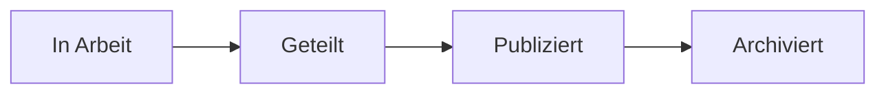

# Gemeinsame Datenumgebung (CDE)

Die CDE ist die **einzige verbindliche Informationsquelle** im Projekt.
Alle Modelle, Dokumente und Auswertungen durchlaufen dort einen
nachvollziehbaren Statusworkflow:

| Status | Bedeutung |
| --- | --- |
| In Arbeit | Arbeitsstand des erstellenden Teams, nicht verbindlich |
| Geteilt | Zur Koordination mit anderen Beteiligten freigegeben |
| Publiziert | Geprüfter, verbindlicher Stand |
| Archiviert | Abgelöster Stand, bleibt nachvollziehbar erhalten |

:::note
Die projektspezifische CDE-Lösung und deren Bedienung werden hier ergänzt.
:::
