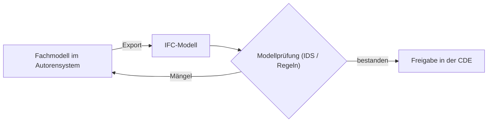

# Modellierungsgrundsätze

Grundprinzipien für alle Fachmodelle:

- **Offene Formate:** Der Austausch erfolgt über IFC; native Formate sind
  Arbeitsstände der Autorensysteme.
- **Georeferenzierung:** Modelle werden im Bezugsrahmen LV95 (CH1903+)
  verortet.
- **Prüfbarkeit:** Informationsanforderungen werden maschinenlesbar
  (z. B. als IDS) definiert und vor der Freigabe geprüft.
- **Eindeutigkeit:** Bauteile erhalten stabile Identifikatoren und werden
  gemäss vereinbarter Klassifikation attribuiert.

## Qualitätssicherung im Überblick

:::note
Detaillierte Vorgaben je Fachbereich werden in eigenen Unterseiten ergänzt.
:::
